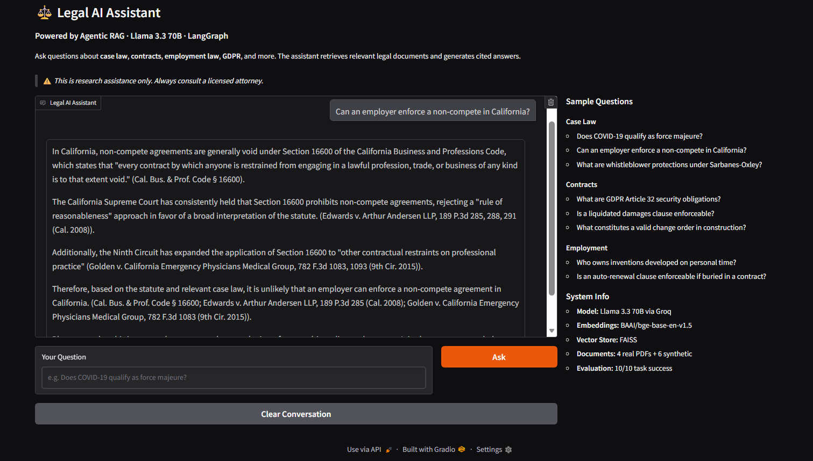

# ⚖️ Legal AI Assistant — Powered by Agentic RAG

**ITI Generative AI Capstone Project — 2026**

**Skills Demonstrated:** Gen AI Fundamentals · Prompt Engineering · Multi-Provider Models · RAG with LangChain · LangGraph Agents · Agent Evaluation · Model Selection

---

## Overview

A production-like Legal AI Assistant that enables lawyers and law students to quickly retrieve, analyze, and reason over case law and contracts. Rather than returning generic responses, the system retrieves the exact relevant sections from a curated legal document collection and generates structured, cited answers grounded in retrieved text.

Built as the capstone project for the ITI Generative AI course, covering every course topic from prompt engineering and RAG pipelines to stateful agents and evaluation frameworks.

---

## Architecture

```
User Query → Sanitize → Embed → FAISS Vector Search → Top-4 Chunks
                                                            |
                                                  Sufficiency Check
                                               ↙                  ↘
                                          Sufficient          Insufficient
                                              |                     |
                                     Generate Answer      Expand Query Terms
                                                          (same knowledge base)
                                                                 |
                                                         Generate Answer
                                                         or Flag as Outside
                                                         Knowledge Base
```

## Demo



---
## Tech Stack

| Component | Tool |
|---|---|
| LLM | Llama 3.3 70B via Groq (free tier) |
| Embeddings | BAAI/bge-base-en-v1.5 (HuggingFace) |
| Vector Store | FAISS (local) |
| Agent Framework | LangGraph — Option B Stateful Agent |
| Document Loading | PyMuPDF + LangChain |
| Prompt Strategies | System Prompt, Few-Shot, Chain-of-Thought |
| Demo Interface | Gradio |
| Runtime | Google Colab |

---

## Evaluation Results

Evaluated across all 10 realistic legal case scenarios using LLM-based faithfulness scoring.

| Metric | Result |
|---|---|
| Faithfulness Score | 0.63 / 1.0 |
| Task Success Rate | 10 / 10 (100%) |
| Average Response Latency | 1.84 seconds |
| Total API Cost | $0.004 |
| Hallucination Flags | 2 / 10 — correctly flagged, topic absent from knowledge base |

The 2 flagged cases (IP Ownership and SaaS Auto-Renewal) scored low because the knowledge base does not contain documents covering those specific topics. The agent correctly admitted insufficient context rather than fabricating an answer — this is the intended RAG behavior.

---

## Knowledge Base

10 legal documents covering all project case scenarios: force majeure, non-compete clauses, GDPR data breach liability, IP ownership, liquidated damages, SaaS auto-renewal, whistleblower protections, construction disputes, trade secrets, and mandatory arbitration.

Sources: CourtListener (real case law), SEC EDGAR and LawInsider (real contracts), and synthetically generated documents grounded in real legal doctrine for topics not available as clean public PDFs.

---

## Quick Start

**Prerequisites:** A Google account and a free Groq API key from [console.groq.com](https://console.groq.com)

1. Open `Legal_AI_Assistant.ipynb` in Google Colab
2. Add `GROQ_API_KEY` and `HF_TOKEN` to Colab Secrets (key icon, left sidebar)
3. Click **Runtime → Run all**
4. When prompted in Section 4, upload the 4 PDFs from the `data/` folder
5. Run Section 10 to launch the interactive Gradio demo — a public shareable link will be generated automatically

Total runtime from scratch: approximately 10–12 minutes.

---

## Project Structure

```
Legal-AI-Assistant/
├── data/                          # Legal knowledge base (4 PDFs)
├── Legal_AI_Assistant.ipynb       # Main notebook — all 10 sections
├── requirements.txt               # Python dependencies
├── .env.example                   # API key template
├── .gitignore                     # Excludes secrets and generated files
└── README.md                      # Project documentation
```

## Security

API keys are stored exclusively in Colab Secrets and never hardcoded. User inputs are sanitized against prompt injection patterns. An attorney disclaimer is enforced on every response via the system prompt. Only public domain and synthetically generated documents are used — no real client data.

---

## ⚠️ Disclaimer

This tool is for research assistance only. Always consult a licensed attorney for legal advice.
